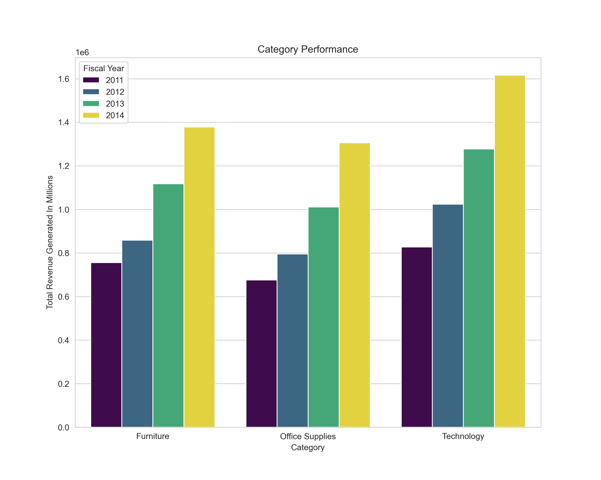
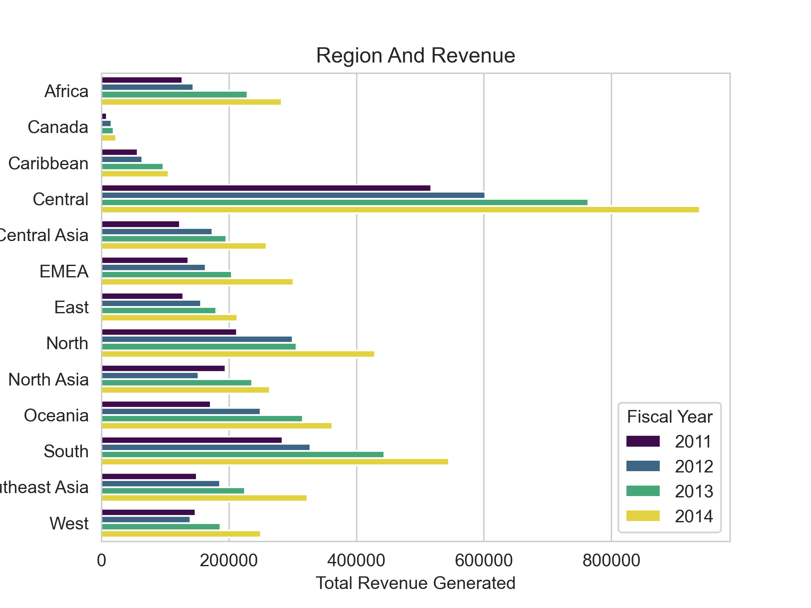
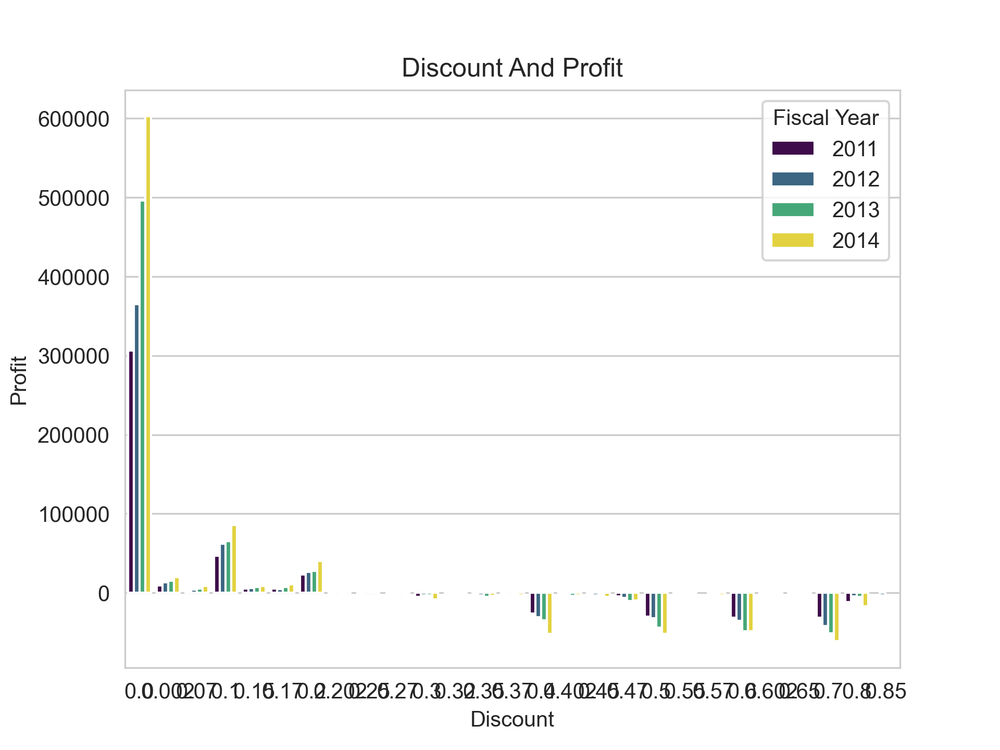
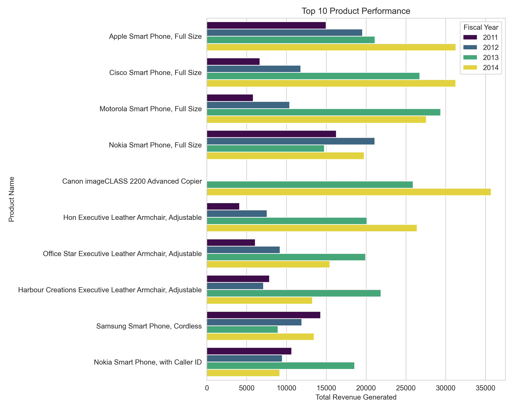
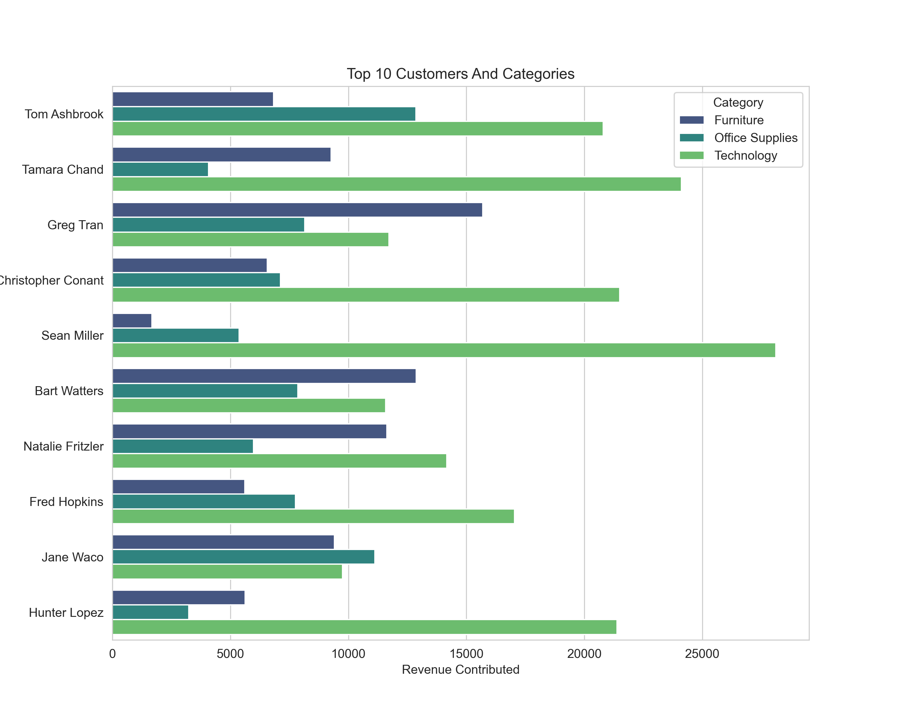

# E-Commerce Sales Analysis

A complete end-to-end Business & Sales Analysis project built using **Python, SQL, and Google Sheets**.

The objective of this project is to discover business insights from an E-Commerce dataset by performing data cleaning, exploratory data analysis (EDA), SQL-based business queries, and spreadsheet analysis using Pivot Tables and Charts.

---

# Project Overview

This project analyzes thousands of customer orders to answer business questions such as:

- Which products generate the highest revenue?
- Which categories are the most profitable?
- Which regions and markets perform best?
- Which products are consistently making losses?
- How do discounts affect profitability?
- Who are the highest-value customers?
- Which months generate maximum profit?
- What business insights can SQL reveal beyond visual analysis?

---

# Tech Stack

- Python
- Pandas
- Matplotlib
- Seaborn
- MySQL
- Google Sheets (Pivot Tables, Charts, Conditional Formatting)

---

# Project Structure

```
E-Commerce-Sales-Analysis/
│
├── Data/
│   └── SuperStoreOrders.csv
│
├── Graphs/
│   ├── Category_Performance.png
│   ├── Category_Profit.png
│   ├── Region_Revenue.png
│   ├── Region_Profit.png
│   ├── Discount_Profit.png
│   ├── Top_10_Product_Performance.png
│   ├── Customer_Category.png
│   └── ...
│
├── SpreadSheets/
│   ├── PivotTable_RegionalSales.png
│   └── Dashboard.png
│
├── SQL/
│   └── Business_Queries.sql
│
├── analysis.py
├── requirements.txt
├── .gitignore
└── README.md
```

---

# Analysis Performed

###  Data Assessment

- Dataset inspection
- Data type verification
- Missing value analysis
- Duplicate record detection
- Data cleaning

---

###  Sales Analysis

- Category Performance
- Segment Performance
- Product Performance
- Country Analysis
- Market Analysis
- Region Analysis
- Order Priority Analysis

---

###  Profit Analysis

- Category Profitability
- Product Profitability
- Loss-Making Products
- Region Profit
- Market Profit
- Discount vs Profit

---

###  Customer Analysis

- Highest Revenue Customers
- Customer Segmentation
- Category-wise Customer Contribution

---

###  Time-Based Analysis

- Year-wise Orders
- Most Profitable Months
- Least Profitable Months

---

###  Shipping Analysis

- Market-wise Shipping Cost

---

###  SQL Business Analysis

Business questions answered using SQL:

- Order distribution by category
- Revenue by category
- Profit by category
- Revenue by country
- Profit by region
- Top customers
- Loss-making products
- Discounts vs Profit
- Shipping mode analysis
- Order priority analysis

---

#  Key Business Insights

## Revenue & Profit

- 2014 generated the highest revenue and profit across nearly every business dimension.
- Technology is the highest revenue and highest profit generating category despite having the fewest orders.
- Phones and Copiers are the strongest-performing sub-categories.
- Canon imageCLASS 2200 Advanced Copier emerged as the highest revenue and profit generating product from 2013 onwards.

---

## Regional Performance

- APAC and EU are the strongest performing markets.
- Central region generated significantly higher revenue and profit than other regions.
- United States, Australia and France are the highest revenue generating countries.

---

## Product Performance

- Smartphones account for 6 of the Top 10 highest revenue products.
- Three of the five least profitable products are printers.
- Cubify CubeX 3D Printer generated substantial losses before showing slight recovery in 2014.

---

## Customer Insights

- Consumer segment generated the highest revenue and profit.
- SQL analysis revealed this is primarily driven by having the highest order volume rather than higher profitability per order.

---

## Discounts

- Products with little or no discount remain consistently profitable.
- Discounts above approximately 30% consistently resulted in overall losses, suggesting aggressive discounting significantly impacts profitability.

---

## Time Analysis

- Four of the five most profitable months occurred during 2014.
- September, October and November consistently appeared among the strongest performing months.
- January and July frequently appeared among the least profitable periods.

---

## SQL Findings

SQL analysis validated several EDA findings while providing additional business context:

- Technology receives the fewest orders but generates the highest revenue and profit.
- Consumer segment leads primarily because it receives the highest number of orders.
- Medium priority orders dominate both sales volume and profitability due to significantly higher order counts.
- Office Supplies receives the highest number of orders and therefore accumulates the highest overall discount value.

---

#  Sample Visualizations

## Category Performance



---

## Region Revenue



---

## Discount vs Profit



---

## Top Product Performance



---

## Customer Analysis



---

## Google Sheets Pivot Tables


---